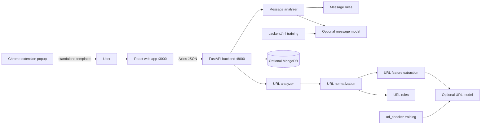

# SafeShield Architecture and AI Context

This document is the source of truth for understanding the repository before proposing changes. Read it with the code; when behavior differs, the code wins and this document should be corrected.

## System Boundary

The web application is the only currently implemented client that exercises the live analysis API. The extension has no backend dependency in its current implementation.

## Runtime Request Flow

### Message

1. `backend/main.py` validates a JSON body containing `message`.
2. `backend/analyzer/message_analyzer.py` lowercases and whitespace-normalizes the text, then checks word-boundary patterns for urgency, banking, credentials, finance, downloads, links, threats, and sensitive information.
3. Credential and sensitive-information requests receive additional indicators when request verbs such as `send`, `enter`, `confirm`, or `verify` are present.
4. `backend/risk_engine.py` combines rule indicators and an optional `backend/ml/models/message_model.joblib` prediction.
5. The score is capped at 100. A non-suspicious message is capped below 25, which maps to `LOW`.
6. The API creates an `SS-XXXXXXXXXX` analysis ID, optionally stores metadata plus a message hash, and returns the analysis response.

The model is supportive, not authoritative: rule-based suspicion is enough to classify a message as suspicious, and the system still works when the model is absent.

### URL

1. `backend/main.py` validates and trims a URL string.
2. `url_checker/dataset/utils/url_normalize.py` creates the normalized representation used downstream. It can add a scheme, remove selected tracking parameters, normalize paths, and flag IP, punycode, or malformed-host cases.
3. `url_checker/dataset/utils/url_features.py` extracts structural URL features.
4. `url_checker/dataset/utils/url_rules.py` produces hard/soft findings, reasons, domain validity, and unusual findings.
5. `backend/analyzer/url_analyzer.py` loads `url_model_calibrated.pkl` first, then `url_model.pkl`, and computes model and rule probabilities.
6. The combined probability weights the model at 60% and rules at 40%. Suspicious rule findings enforce a minimum score, and any `suspicious` result produces a `FRAUD` verdict even when the score is below 50.
7. The API returns both the original and normalized URL plus the explainability fields.

This means URL verdict and numeric score are related but not identical. Do not change one without checking both the analyzer and API tests.

## API Contract

| Method | Route | Request | Purpose |
|---|---|---|---|
| GET | `/` | none | Service metadata and documentation links |
| GET | `/health` | none | Health response |
| POST | `/analyze/message` | `{message: string}` | Analyze message risk |
| POST | `/analyze/url` | `{url: string}` | Analyze URL risk |

CORS allows `http://localhost:3000`, `http://127.0.0.1:3000`, and `chrome-extension://*`. Allowed methods are GET and POST.

Request models reject unknown fields. Message length is 1-5000 characters; URL length is 1-2048 characters. Blank messages and URLs are rejected after trimming.

Common response concepts:

- `risk_score`: integer from 0 to 100.
- `risk_level`: `LOW`, `MEDIUM`, `HIGH`, or `CRITICAL` based on score thresholds 25, 50, and 75.
- `category`: analyzer-specific label such as `Benign`, `phishing`, `scam`, `credential_theft`, `financial_fraud`, or `malicious_download`.
- `reasons` and `detected_indicators`: explainability data for UI and debugging.
- `model_prediction`: model result or `unavailable`.
- `model_confidence` and `rule_confidence`: separate evidence confidence values.

Persistence is optional. `backend/database.py` reads `backend/.env`; when `MONGODB_URI` is absent, `analyses_collection` is `None` and the API returns results without saving. If insertion fails while MongoDB is configured, the endpoint returns HTTP 503.

## Component Inventory

### Backend

- `backend/main.py`: FastAPI application, CORS, request/response Pydantic models, routes, IDs, persistence calls.
- `backend/analyzer/message_analyzer.py`: deterministic message indicator extraction.
- `backend/analyzer/url_analyzer.py`: URL normalization, rule/model orchestration, URL response dataclass.
- `backend/analyzer/apk_analyzer.py`: APK analysis module; currently not routed.
- `backend/analyzer/image_analyzer.py`: image analysis module; currently not routed.
- `backend/risk_engine.py`: message model loading, rule scoring, category selection, recommendations, message hashing.
- `backend/database.py`: optional MongoDB client and `analyses` collection setup.
- `backend/test_api.py`: `unittest` plus FastAPI `TestClient` coverage for health and message behavior.
- `backend/data_sources.md`: provenance and notes for message datasets.

### Message ML

- `backend/ml/preprocess.py`: preprocessing helpers.
- `backend/ml/build_message_dataset.py`: builds message feature data.
- `backend/ml/train_message_model.py`: trains and saves the message model.
- `backend/ml/test_message_model.py`: model smoke test.
- `backend/data/messages.csv`: curated message data.
- `backend/data/messages_features.csv`: engineered message features.
- `backend/data/spam.csv`: spam corpus input.
- `backend/ml/models/message_model.joblib`: generated runtime artifact when training has been run.

### URL Checker

- `url_checker/train_model.py`: URL training and calibration pipeline.
- `url_checker/dataset/utils/url_normalize.py`: URL canonicalization and structural flags.
- `url_checker/dataset/utils/url_features.py`: model feature extraction.
- `url_checker/dataset/utils/url_rules.py`: hard and soft heuristic checks.
- `url_checker/dataset/utils/text_clean.py`: text-cleaning helper.
- `url_checker/scripts/test_rule_check.py`: rule smoke checks.
- `url_checker/scripts/evaluate_url_checker.py`: evaluates the backend URL analyzer and writes failure data.
- `url_checker/model/`: serialized models and `url_model_calibration_info.json`.
- `url_checker/dataset/`: training/evaluation CSVs, forced negatives, scan logs, and raw provider response snapshots.

### Frontend

- `frontend/src/main.jsx`: React entry point and StrictMode mount.
- `frontend/src/App.jsx`: page selection, navigation state, and backend health state.
- `frontend/src/api.js`: Axios client with hard-coded backend base URL.
- `frontend/src/pages/Dashboard.jsx`: dashboard placeholder view.
- `frontend/src/pages/MessageScanner.jsx`: message input and result view.
- `frontend/src/pages/URLScanner.jsx`: URL input and result view.
- `frontend/src/**/*.css`: visual styles for the application and scanner views.
- `frontend/vite.config.js`: Vite development server configuration, port 3000 with strict port behavior.
- `frontend/package.json`: scripts and React/Axios/Vite dependencies.

### Extension

- `extension/manifest.json`: Manifest V3 metadata, storage permission, and unused WhatsApp host permission.
- `extension/popup.html`: popup shell.
- `extension/popup.js`: local popup behavior and hard-coded analysis templates; stores the last result under `safeShieldLastResult`.
- `extension/popup.css`: popup styles.
- `extension/content.js`: currently empty and not registered in the manifest.

## Data and Model Notes

The URL training pipeline uses `urls.csv`, `urls_train.csv`, optional `verified_online.csv` when present, `negatives_seed.csv`, `forced_negatives.txt`, and generated safe URL variants. In this checkout, `verified_online.csv` is not guaranteed to exist, so training must tolerate the fallback path.

The URL model artifacts include calibrated, regular, light, backup, text, and vectorizer files. Runtime loading is lazy and failures are caught broadly, so a compatibility problem may appear only as `model_prediction: "unavailable"`. Check the training/runtime scikit-learn and joblib versions before replacing artifacts.

Raw provider responses under `url_checker/dataset/raw_responses/` are datasets or audit material, not a live provider call path. Treat them as potentially sensitive and avoid exposing credentials or unnecessary response contents in logs or documentation.

## AI Change Guidance

Before changing behavior:

1. Identify whether the change belongs in the route, analyzer, risk engine, model training code, frontend client, or extension.
2. Trace the response field from its computation to `backend/main.py` and the consuming UI.
3. Preserve explainability and add a focused test for new categories, thresholds, normalization, or failure behavior.
4. Check optional-model and no-MongoDB behavior; local development should remain usable without either service.
5. Keep message plaintext out of persisted documents and diagnostic output.
6. Update this document when a feature becomes live, a route changes, a model path changes, or a previously documented integration is removed.

Avoid broad refactors while changing detection rules. Rule names and category strings are used by tests and UI expectations. URL normalization changes can alter both displayed output and model features, so validate representative safe, suspicious, malformed, IP-host, and punycode URLs.

## Known Gaps and Safe Next Steps

- Add a frontend environment-based API URL instead of the hard-coded localhost value.
- Add backend URL endpoint tests and focused analyzer tests.
- Decide whether MongoDB failures should fail requests or return unsaved analysis with an explicit persistence warning.
- Wire the extension to a deliberate backend contract before adding content-script access.
- Either route APK/image analyzers or remove them from the advertised product scope.
- Reconcile older subsystem documentation with the current implementation, especially external API claims and license/author statements.
