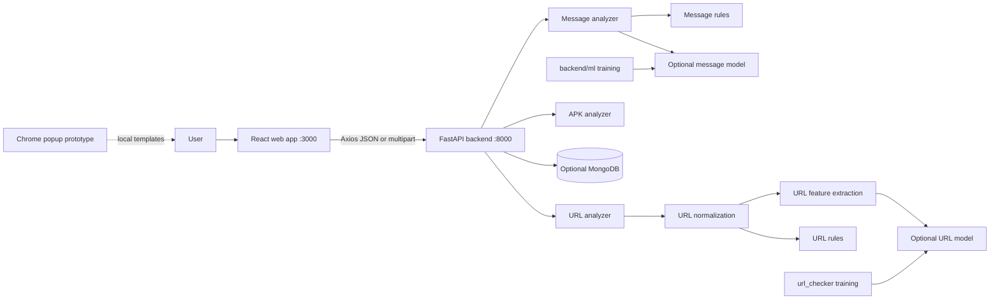

# SafeShield Architecture and AI Context

This document is the source of truth for understanding the repository before proposing changes. Read it with the code; when behavior differs, the code wins and this document should be corrected.

## System Boundary

The React web application is the implemented live client. The extension is standalone and has no backend dependency. Image analysis code exists but is not routed.

## Runtime Request Flow

### Message

1. `backend/main.py` validates a JSON body containing `message`, rejecting unknown fields and enforcing the 1-5000 character limit.
2. `backend/analyzer/message_analyzer.py` lowercases and whitespace-normalizes text, then checks word-boundary patterns for urgency, banking, credentials, finance, downloads, links, threats, and sensitive information.
3. Credential and sensitive-information requests receive additional indicators when request verbs such as `send`, `enter`, `confirm`, or `verify` are present.
4. `backend/risk_engine.py` combines rule indicators with an optional message model prediction.
5. The score is capped at 100. A non-suspicious message is capped below 25, which maps to `LOW`.
6. The API creates an `SS-XXXXXXXXXX` ID, optionally stores metadata plus a message hash, and returns the response.

The model is supportive, not authoritative. The system remains usable when the message model is absent.

### URL

1. `backend/main.py` trims and validates a URL string.
2. `url_checker/dataset/utils/url_normalize.py` creates the normalized representation. It can add a scheme, remove selected tracking parameters, normalize paths, and flag IP, punycode, or malformed-host cases.
3. `url_checker/dataset/utils/url_features.py` extracts structural URL features.
4. `url_checker/dataset/utils/url_rules.py` produces suspicion, reasons, domain validity, and unusual findings.
5. `backend/analyzer/url_analyzer.py` loads `url_model_calibrated.pkl` first, then `url_model.pkl`, and computes model and rule probabilities.
6. Model probability is weighted at 60% and rule probability at 40%. Suspicious findings enforce a minimum score, and suspicious rule output produces a `FRAUD` verdict even when the score is below 50.
7. The API returns both original and normalized URLs plus explainability fields.

URL verdict and numeric score are related but not identical. Check both the analyzer and API tests when changing either.

### APK

1. `backend/main.py` accepts an `.apk` upload as multipart field `file`.
2. The upload is written to a temporary file and deleted in a `finally` block after analysis.
3. `backend/analyzer/apk_analyzer.py` parses the package with Androguard without executing it.
4. The analyzer calculates SHA-256, reads package metadata, permissions, and component counts, and searches DEX content for suspicious APIs.
5. Permission and API findings contribute points; the score is capped at 100.
6. The verdict is `low_risk` below 30, `suspicious` from 30 through 59, and `dangerous` at 60 or higher.

APK output is static-analysis evidence, not a complete malware determination.

## API Contract

| Method | Route | Request | Purpose |
|---|---|---|---|
| GET | `/` | none | Service metadata and documentation links |
| GET | `/health` | none | Health response |
| POST | `/analyze/message` | `{message: string}` | Analyze message risk |
| POST | `/analyze/url` | `{url: string}` | Analyze URL risk |
| POST | `/analyze/apk` | multipart `file` | Analyze APK risk |

CORS allows `http://localhost:3000`, `http://127.0.0.1:3000`, and `chrome-extension://*`. Allowed methods are GET and POST.

Request models reject unknown fields. Message length is 1-5000 characters; URL length is 1-2048 characters. Blank messages and URLs are rejected after trimming.

Common response concepts:

- `risk_score`: integer from 0 to 100.
- `risk_level`: `LOW`, `MEDIUM`, `HIGH`, or `CRITICAL` based on score thresholds 25, 50, and 75.
- `category`: analyzer-specific label such as `Benign`, `phishing`, `scam`, `credential_theft`, `financial_fraud`, or `malicious_download`.
- `reasons` and `detected_indicators`: explainability data for UI and debugging.
- `model_prediction`: model result or `unavailable`.
- `model_confidence` and `rule_confidence`: separate evidence confidence values.

Message and URL analyses are optionally persisted to MongoDB. Message plaintext is represented by a SHA-256 hash in persisted documents. APK results are returned by the route but are not persisted by the current implementation.

## Component Inventory

### Backend

- `backend/main.py`: FastAPI application, CORS, request/response models, IDs, routes, temporary APK handling, and persistence calls.
- `backend/analyzer/message_analyzer.py`: deterministic message indicator extraction.
- `backend/analyzer/url_analyzer.py`: URL normalization, rule/model orchestration, and URL response dataclass.
- `backend/analyzer/apk_analyzer.py`: static APK metadata, permission, DEX, and component analysis.
- `backend/analyzer/image_analyzer.py`: image analysis module; currently not routed.
- `backend/risk_engine.py`: message model loading, rule scoring, category selection, recommendations, and message hashing.
- `backend/database.py`: optional MongoDB client and `analyses` collection setup.
- `backend/test_api.py`: `unittest` and FastAPI `TestClient` coverage for health and message behavior.
- `backend/data_sources.md`: provenance and notes for message datasets.

### Message ML

- `backend/ml/preprocess.py`: preprocessing helpers.
- `backend/ml/build_message_dataset.py`: builds message feature data.
- `backend/ml/train_message_model.py`: trains and saves the message model.
- `backend/ml/test_message_model.py`: model smoke test.
- `backend/data/messages.csv`: curated message data.
- `backend/data/messages_features.csv`: engineered message features.
- `backend/data/spam.csv`: spam corpus input.
- `backend/ml/models/message_model.joblib`: generated runtime artifact when training has been run.

### URL Checker

- `url_checker/train_model.py`: URL training and calibration pipeline.
- `url_checker/dataset/utils/url_normalize.py`: URL canonicalization and structural flags.
- `url_checker/dataset/utils/url_features.py`: model feature extraction.
- `url_checker/dataset/utils/url_rules.py`: hard and soft heuristic checks.
- `url_checker/dataset/utils/text_clean.py`: text-cleaning helper.
- `url_checker/scripts/test_rule_check.py`: rule smoke checks.
- `url_checker/scripts/evaluate_url_checker.py`: evaluates URL analysis and writes failure data.
- `url_checker/model/`: serialized models and calibration metadata.
- `url_checker/dataset/`: training/evaluation CSVs, forced negatives, scan logs, and raw provider snapshots.

### Frontend

- `frontend/src/main.jsx`: React entry point and StrictMode mount.
- `frontend/src/App.jsx`: page selection, navigation state, and backend health state.
- `frontend/src/api.js`: Axios client for health, message, URL, and multipart APK requests.
- `frontend/src/pages/Dashboard.jsx`: dashboard placeholder view.
- `frontend/src/pages/MessageScanner.jsx`: message input and result view.
- `frontend/src/pages/URLScanner.jsx`: URL input and result view.
- `frontend/src/pages/ApkScanner.jsx`: APK file selection, upload, and result view.
- `frontend/src/**/*.css`: application and scanner styles.
- `frontend/vite.config.js`: Vite development server configuration on port 3000 with strict port behavior.
- `frontend/package.json`: React, Axios, Vite, and build scripts.

### Extension

- `extension/manifest.json`: Manifest V3 metadata and permissions.
- `extension/popup.html`: popup shell.
- `extension/popup.js`: local popup behavior and hard-coded analysis templates; stores the last result under `safeShieldLastResult`.
- `extension/popup.css`: popup styles.
- `extension/content.js`: currently empty and not registered in the manifest.

## Data and Model Notes

The URL training pipeline uses `urls.csv`, `urls_train.csv`, optional `verified_online.csv`, `negatives_seed.csv`, `forced_negatives.txt`, and generated safe URL variants. Training must tolerate the optional verified-online dataset being absent.

Runtime model loading is lazy and failures are caught broadly. A compatibility problem may appear only as `model_prediction: "unavailable"`; check training and runtime versions of scikit-learn and joblib before replacing artifacts.

Raw provider responses under `url_checker/dataset/raw_responses/` are dataset or audit material, not a live provider-call path. Treat them as potentially sensitive and avoid exposing credentials or unnecessary response contents in logs or documentation.

## AI Change Guidance

Before changing behavior:

1. Identify whether the change belongs in a route, analyzer, risk engine, model training code, frontend client, or extension.
2. Trace every response field from computation through `backend/main.py` to the consuming UI.
3. Preserve explainability and add focused tests for new categories, thresholds, normalization, upload validation, or failure behavior.
4. Check optional-model and no-MongoDB behavior; local development should remain usable without either service.
5. Keep message plaintext out of persisted documents and diagnostic output.
6. Update this document when a feature becomes live, a route changes, a model path changes, or an integration is removed.

Avoid broad refactors while changing detection rules. Rule names and category strings are used by tests and UI expectations. URL normalization changes can alter displayed output and model features, so validate representative safe, suspicious, malformed, IP-host, and punycode URLs. APK changes should include benign, permission-heavy, and malformed-file cases where fixtures are available.

## Known Gaps and Safe Next Steps

- Add a frontend environment-based API URL instead of the hard-coded localhost value.
- Add dedicated URL and APK endpoint tests plus focused analyzer tests.
- Decide whether MongoDB failures should fail requests or return unsaved analysis with an explicit persistence warning.
- Wire the extension to a deliberate backend contract before adding content-script access.
- Route image analysis or remove it from the advertised product scope.
- Add a frontend test suite for scanner states and API failures.
- Reconcile older URL-checker documentation with the current implementation and remove stale external-service claims.
